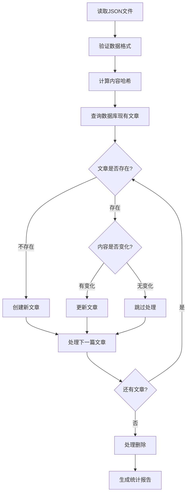

# 文章同步脚本使用说明

## 概述

`sync-articles.js` 是一个Node.js脚本，用于将本地 `json/` 文件夹中的JSON文件自动同步到PostgreSQL数据库。

## 功能特性

- ✅ **新增**：数据库中不存在的文章自动插入
- 🔄 **修改**：基于内容哈希检测变化，自动更新
- 🗑️ **删除**：JSON文件中不存在的文章标记为软删除
- 📊 **统计报告**：详细的同步统计信息
- 🛡️ **数据验证**：完整的数据格式验证
- ⚡ **性能优化**：批量处理和增量同步

## 安装依赖

确保项目已安装必要的依赖：

```bash
# 如果还没有安装Prisma Client
npm install @prisma/client

# 确保数据库已初始化
npx prisma generate
npx prisma migrate dev
```

## 使用方法

### 1. 基本使用

```bash
# 在项目根目录执行
node utils/sync-articles.js
```

### 2. 脚本参数

当前版本支持直接执行，未来可扩展命令行参数：

```bash
# 计划支持的参数（未来版本）
node utils/sync-articles.js --dry-run    # 预览模式，不实际执行
node utils/sync-articles.js --force      # 强制更新所有文章
node utils/sync-articles.js --verbose    # 详细输出模式
```

## JSON文件格式要求

### 标准格式

```json
{
  "articles": [
    {
      "slug": "unique-article-slug",
      "title": "文章标题",
      "summary": "文章摘要（可选）",
      "content": "文章内容（Markdown格式）",
      "coverImage": "https://example.com/image.jpg",
      "readTime": 10,
      "category": "技术教程",
      "isPublished": true,
      "isDraft": false,
      "viewCount": 0,
      "likes": 0,
      "bookmarks": 0,
      "comments": 0,
      "userId": 1
    }
  ]
}
```

### 必需字段

| 字段 | 类型 | 说明 |
|------|------|------|
| `slug` | String | 文章唯一标识符，最大256字符 |
| `title` | String | 文章标题，最大256字符 |
| `content` | String | 文章内容，支持Markdown |

### 可选字段

| 字段 | 类型 | 默认值 | 说明 |
|------|------|--------|------|
| `summary` | String | null | 文章摘要 |
| `coverImage` | String | null | 封面图片URL |
| `readTime` | Number | null | 预计阅读时间（分钟） |
| `category` | String | "uncategorized" | 文章分类 |
| `isPublished` | Boolean | false | 是否已发布 |
| `isDraft` | Boolean | true | 是否为草稿 |
| `viewCount` | Number | 0 | 浏览次数 |
| `likes` | Number | 0 | 点赞数 |
| `bookmarks` | Number | 0 | 收藏数 |
| `comments` | Number | 0 | 评论数 |
| `userId` | Number | 1 | 作者用户ID |

## 工作原理

### 1. 内容变化检测

脚本使用MD5哈希算法计算以下字段的组合哈希：
- `title`
- `slug`  
- `summary`
- `content`

只有当这些核心内容字段发生变化时，才会更新数据库。

### 2. 同步流程



### 3. 软删除机制

- 不会物理删除数据库中的文章
- 将文章标记为 `isPublished: false, isDraft: true`
- 保留所有历史数据和统计信息

## 输出示例

```
🚀 开始同步文章...

📁 发现 3 个JSON文件
  ✅ sample-articles.json: 1 篇文章
  ✅ sample-articles-2.json: 1 篇文章
  ✅ sample-articles-3.json: 1 篇文章
📊 总计发现 3 篇文章

🗄️ 数据库中现有 2 篇文章

📝 开始处理文章...

  ✅ 创建: new-article-slug
  🔄 更新: existing-article-slug
  ⏭️ 跳过: unchanged-article-slug (无变化)
  🗑️ 软删除: deleted-article-slug

==================================================
📊 同步统计报告
==================================================
📄 总文章数:   3
✅ 新增:       1
🔄 更新:       1
🗑️ 删除:       1
⏭️ 跳过:       1
❌ 错误:       0
==================================================
🎉 同步完成，无错误！
```

## 错误处理

### 常见错误及解决方案

1. **数据库连接失败**
   ```
   ❌ 查询数据库失败: connect ECONNREFUSED
   ```
   - 检查 `.env` 文件中的 `DATABASE_URL` 配置
   - 确保PostgreSQL服务正在运行

2. **JSON格式错误**
   ```
   ❌ sample-articles.json: 读取失败 - Unexpected token
   ```
   - 检查JSON文件语法是否正确
   - 使用JSON验证工具检查格式

3. **数据验证失败**
   ```
   ❌ 创建失败: 数据验证失败: 缺少必需字段: slug
   ```
   - 确保所有必需字段都已提供
   - 检查字段类型和长度限制

4. **唯一性约束冲突**
   ```
   ❌ 创建失败: Unique constraint failed on the constraint: `articles_slug_key`
   ```
   - 确保所有文章的slug都是唯一的
   - 检查是否有重复的slug值

## 最佳实践

### 1. 备份数据库

在执行同步前，建议备份数据库：

```bash
# PostgreSQL备份
pg_dump -U username -h localhost database_name > backup.sql
```

### 2. 测试环境验证

先在测试环境执行同步，确认无误后再在生产环境执行。

### 3. 定期同步

可以配置定时任务定期执行同步：

```bash
# 添加到crontab，每天凌晨2点执行
0 2 * * * cd /path/to/project && node utils/sync-articles.js >> /var/log/article-sync.log 2>&1
```

### 4. 监控日志

将脚本输出重定向到日志文件：

```bash
node utils/sync-articles.js >> sync.log 2>&1
```

## 扩展功能

### 1. 集成到npm scripts

在 `package.json` 中添加脚本：

```json
{
  "scripts": {
    "sync:articles": "node utils/sync-articles.js",
    "sync:articles:verbose": "node utils/sync-articles.js --verbose"
  }
}
```

使用：
```bash
npm run sync:articles
```

### 2. 添加到CI/CD流程

在GitHub Actions中自动执行：

```yaml
# .github/workflows/sync-articles.yml
name: Sync Articles
on:
  push:
    paths:
      - 'json/**'
      
jobs:
  sync:
    runs-on: ubuntu-latest
    steps:
      - uses: actions/checkout@v2
      - uses: actions/setup-node@v2
        with:
          node-version: '18'
      - run: npm install
      - run: npm run sync:articles
```

## 故障排除

### 1. 权限问题

确保脚本有读取JSON文件的权限：

```bash
chmod +r json/*.json
```

### 2. 内存不足

对于大量文章，可能需要增加Node.js内存限制：

```bash
node --max-old-space-size=4096 utils/sync-articles.js
```

### 3. 数据库锁定

如果遇到数据库锁定，可以尝试：

```sql
-- 查看当前锁定
SELECT * FROM pg_locks WHERE NOT GRANTED;

-- 终止长时间运行的查询
SELECT pg_terminate_backend(pid) FROM pg_stat_activity WHERE state = 'active' AND query_start < now() - interval '5 minutes';
```

## 联系支持

如果遇到问题，请检查：

1. 📖 [项目文档](../docs/)
2. 🐛 [问题追踪](https://github.com/example/blog/issues)
3. 💬 [讨论区](https://github.com/example/blog/discussions)

---

*最后更新：2024年8月23日*
